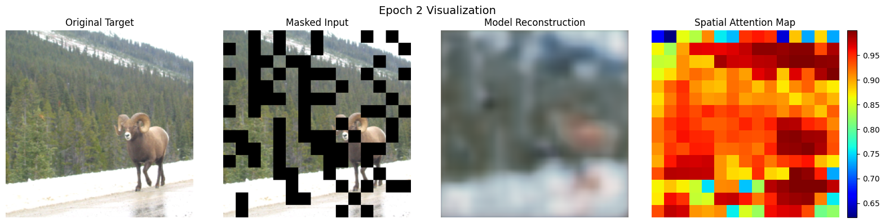

# ImageNet Classification on the MLA-100

This repository is meant to track snapshots in developments for developing an ImageNet Classifier for the Mobilint MLA100 NPU chip.

### Summaries

| Model | Train Accuracy | Validation Accuracy | Details |
| --- | --- | --- | --- | 
| 2026-02-05-experimental | 5.00% | 5.00% | |
| 2026-02-13-experimental | 33.23% | 29.30% | |
| 2026-02-17-experimental-resnet-maps<sup>1</sup> | 63.7% | 51.30% | |
| 2026-02-20-experimental-ssl1 | 37.33% | 34.00% | |
| 2026-02-28-experimental-1 |  | 20.30% | 10 epochs on mixup-only training |
| 2026-02-28-experimental-2 |  | 11.80% | mixup training followed by a mix of HMix, MixUp, CutMix, ResizeMix, and FMix for 10 extra epochs |
| 2026-02-28-experimental-3 |  | 

[1] Used preprocessed DINO2 GradCam annotations



## Contents

```
imagenet-classification-mobilint-mla-100
├──
└── 2026-02-05/
# Prepared baseline data preparation, dataloader, DNN model, and export
├──── imagenet_mla100.ipynb
├──── imagenet_mla100.py
# Prepare report document frame
└──── imagenet_mla.md
|
└── 2026-02-10/
# Prepared an inference script on the MLA-100 device.
├──── inference_script.py
# Reported issues with inference.
└──── issues.md
|
└── 2026-02-13/
# Compilable model that states `Output Shape      = [1, 1, 20]`.
# More explicit shape and output for MXQ inference.
├──── imagenet_mla100.ipynb
├──── imagenet_mla100.py
# Add reporting helper and better evaluation helpers.
└──── imagenet_mla100_02.ipynb
└──── imagenet_mla100_02.py
# A sample reporting PDF. Shows that model mainly collapses to 
# predict everything as the 2nd class (Roseate spoonbill)
└──── report_epoch_003.pdf
# introducing the 2026-02-13-experimental model,
# based off of techniques in papers [1, 2, 3, 4]
└──── imagenet_mla100_03.ipynb
└──── imagenet_mla100_03.py
|
└── 2026-02-17/
# Utilize ResNet50 to create saliency maps (15x15).
# Add a squeeze and excite blocks to model.
└──── imagenet_mla100_resnet_maps.ipynb
└──── imagenet_mla100_resnet_maps.py
|
└── 2026-02-20/
# Rollback and attempt an encoder-decoder 
# architecture as alternative to DINO2
# preprocessing
└──── imagenet_mla100_ssl1.ipynb
└──── imagenet_mla100_ssl2.py
# Repurpose ipynb functionality into a package,
# that is run with a more basic runner.
└──── imagenet_mla100_ssl1/
└──── imagenet_mla100_ssl1_runner.ipynb
└──── imagenet_mla100_ssl1_runner.py
|
└── 2026-02-27/
#example implementation with  k-cutmix
└──── imagenet_mla100_k_cutmix_data_augmentation.ipynb
# add most data augmentations
└──── imagenet_mla100_cutmix_data_augmentation_all.ipynb
# add all augmentations + fix SEAM regularization
└──── imagenet_mla100_cutmix_base_w_augmentations.ipynb
└──── imagenet_mla100_cutmix_base_w_augmentations_2.ipynb
```

